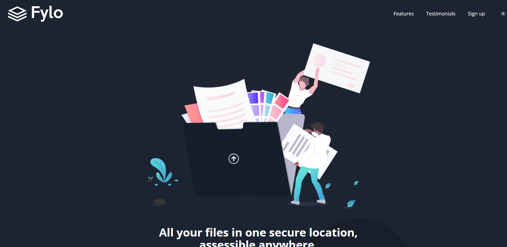

# Frontend Mentor - Fylo dark theme landing page solution

This is a solution to the [Fylo dark theme landing page challenge on Frontend Mentor](https://www.frontendmentor.io/challenges/fylo-dark-theme-landing-page-5ca5f2d21e82137ec91a50fd). Frontend Mentor challenges help you improve your coding skills by building realistic projects. 

Users should be able to:

- View the optimal layout for the site depending on their device's screen size
- See hover states for all interactive elements on the page

### Screenshot

### Links

- Solution URL: [https://www.frontendmentor.io/solutions/landing-page-with-dark-theme-toggler-with-react-and-tailwind-Koyebilegt](https://www.frontendmentor.io/solutions/landing-page-with-dark-theme-toggler-with-react-and-tailwind-Koyebilegt)
- Live Site URL: [https://jaacielbriseo.github.io/fylo-landing-page/](https://jaacielbriseo.github.io/fylo-landing-page/)

### Built with

- Semantic HTML5 markup
- CSS custom properties
- Flexbox
- Mobile-first workflow
- [React](https://reactjs.org/) - JS library
- [Tailwind CSS](https://tailwindcss.com/) - For styles

## Author

- Frontend Mentor - [@JaacielBriseo](https://www.frontendmentor.io/profile/JaacielBriseo)

